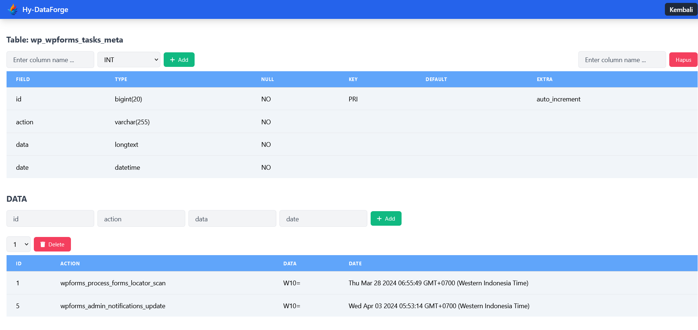

# Hy-DataForge NodeJS

Efficient Data Management Center Site

```
git clone https://github.com/fitri-hy/hy-dataforge-nodejs.git
cd hy-dataforge-nodejs
npm install
npm start
```

## Connection Database

Go to `models/DatabaseModel.js` change this (host, user, password, database):
```
const db = mysql.createConnection({
  host: 'localhost',
  user: 'root',
  password: 'root',
  database: 'demo'
});
```


